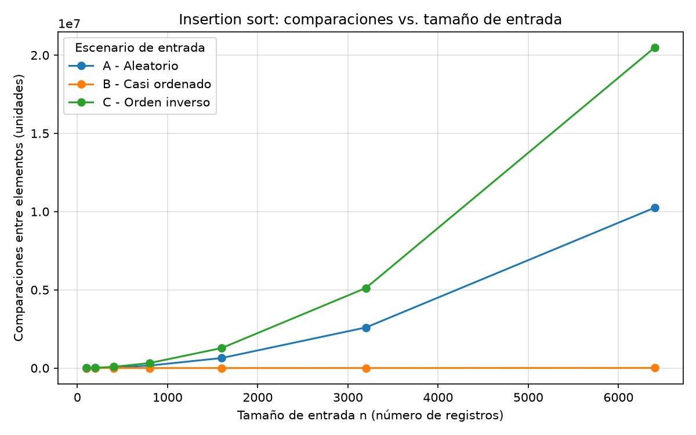
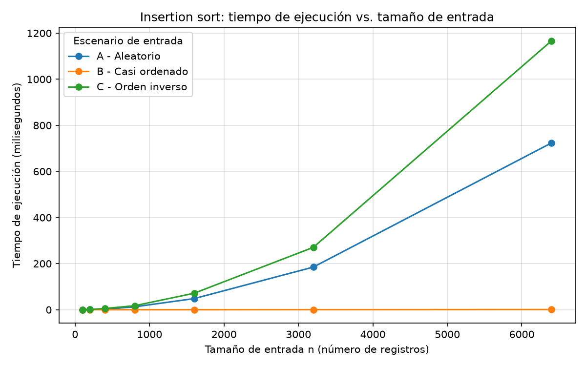
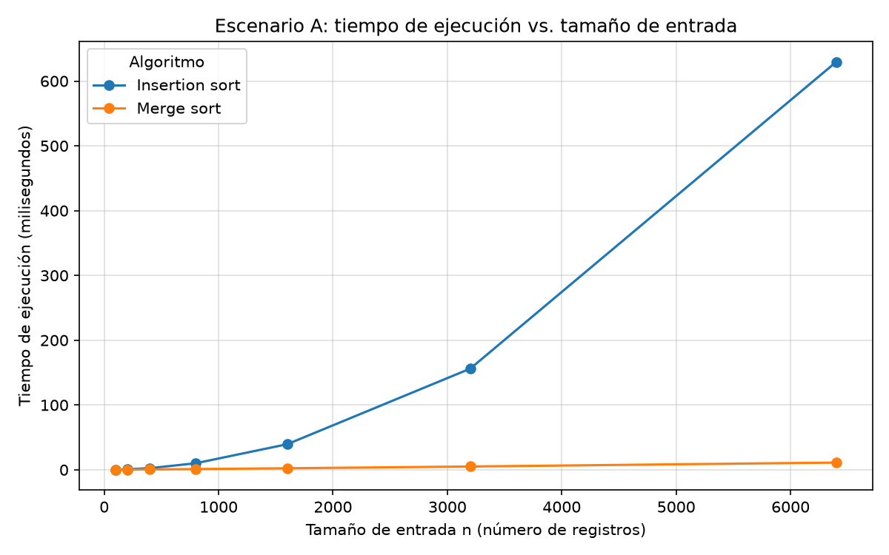

# Laboratorio evaluativo 01 — Fundamentos, complejidad y recurrencias

**Estudiante:** Brayan Alexis Arango Orrego — Análisis de Algoritmos, 2026-2

> Convención usada en todo el informe: la lista final va en orden **descendente de índice de riesgo** (primero el paciente más grave). Generadores, algoritmos y conclusiones respetan esa misma regla.

## Cómo reproducir el experimento

1. Crear y activar el entorno (una sola vez, en la raíz del repositorio):

```bash
python -m venv venv
source venv/Scripts/activate    # Git Bash en Windows
# source venv/bin/activate      # Linux o macOS
pip install -r requirements.txt
```

2. Ejecutar cada parte:

```bash
cd laboratorios/lab1-fundamentos-complejidad-recurrencias
python parte3_casos.py          # Parte 3: imprime la tabla y crea 2 gráficas
python parte4_complejidad.py    # Parte 4: imprime la tabla y crea 1 gráfica
```

Notas de medición: los generadores usan semilla 42, así que las comparaciones se repiten con la misma versión de Python. La medición con `time.perf_counter()` envuelve solo la llamada al algoritmo, y cada tiempo reportado es la mediana de 3 repeticiones para suavizar el ruido del sistema operativo. Los milisegundos cambian de un equipo a otro; la forma de las curvas no.

## Parte 1 — Analizar el algoritmo antes de comprar hardware

Tamiza tiene hoy dos propiedades que conviene no confundir.

**Es correcto.** Un algoritmo de ordenamiento es correcto si, para cualquier lote que reciba, devuelve esos mismos registros acomodados según el criterio pedido. Insertion sort lo logra: en ocho años no se ha encontrado una lista de Tamiza con registros perdidos o fuera de orden.

**No es viable.** Viable quiere decir que el resultado correcto llega cuando todavía sirve, y en Tamiza eso tiene hora fija: el proceso empieza a las 2 de la mañana y la línea de llamadas abre a las 6. Esa ventana de cuatro horas es la restricción que se está violando, y ya dejó tres jornadas con una lista a medias. Que la salida sea correcta no dice nada sobre cuánto tarda en producirse: son propiedades que se verifican por separado, una revisando el resultado y la otra con un reloj.

**Por qué duplicar la velocidad no alcanza.** El problema no apareció porque la máquina se volviera lenta, sino porque el lote creció: de unos 20.000 registros en la versión original a 1.200.000 hoy, 60 veces más. El trabajo de insertion sort es proporcional a n², así que 60 veces más datos equivalen a unas 3.600 veces más trabajo, y un procesador dos veces más rápido solo descuenta un factor 2 de esa cuenta. Mis mediciones muestran el mismo patrón: cada vez que dupliqué n, el tiempo se multiplicó por casi 4 (de 184,97 ms a 723,74 ms entre 3.200 y 6.400 registros, escenario A). El hardware cambia la escala del eje, no la pendiente de la curva.

**Un caso propio.** Como afiliado a SURA intenté descargar desde el portal mi historia clínica completa: cerca de 9 años de consultas, laboratorios y fórmulas, que estimo en unos 150 a 250 documentos (no conozco la cifra exacta). La página quedó cargando y nunca respondió; tuve que recargarla sin obtener el archivo. Supongo que la consulta funciona bien con historias cortas, pero con la mía superó el tiempo máximo que la sesión web espera una respuesta antes de cortarse. La restricción incumplida fue la latencia máxima de la petición, no la exactitud de los datos.

## Parte 2 — Responsabilidad ambiental y ética de la implementación

**Dimensión ambiental.** Cada minuto que el servidor pasa ordenando es un minuto de procesador a plena carga, y eso es electricidad. Con la extrapolación de la Parte 4, insertion sort necesitaría unas 5,7 horas de CPU por madrugada con un lote aleatorio de 1.200.000 registros, y merge sort unos 3 segundos. El proceso no ocurre una vez: corre 365 noches al año. Sumado, son unas 2.080 horas de procesador al año con insertion sort frente a unos 20 minutos con merge sort, y eso se ha repetido durante ocho años seguidos. Hay además un agravante: en las noches en que el proceso no termina a tiempo, toda esa energía se gastó en una lista que no se pudo usar como se debía.

**Dimensión ética.** Veo dos perjuicios concretos:

1. *Un paciente de alto riesgo no recibe la llamada a tiempo.* Si la lista sale incompleta o sin ordenar, alguien con un índice cercano a 1000 puede quedar al final de la cola o fuera de la jornada. El costo lo asume **el paciente**: su valoración cardiovascular se retrasa sin que haya tenido forma de enterarse ni de reclamar.
2. *Los cupos de valoración se los llevan pacientes de menor riesgo.* Las citas disponibles cada día son limitadas. Si la lista va desordenada, pacientes de riesgo bajo ocupan esos cupos y el de riesgo alto, cuando por fin lo llaman, encuentra la agenda llena. De nuevo el costo recae primero sobre **el paciente** más grave; la Secretaría también pierde, porque paga consultas que no se asignaron según la prioridad clínica que el programa promete.

En los dos casos el costo cae sobre quien no tomó la decisión, mientras la responsabilidad recae en quienes sí la toman: el equipo técnico que mantiene el proceso y la Secretaría que decide si se corrige.

**El orden define la prioridad de llamada.** Por eso cualquier falla del ordenamiento se vuelve una falla de priorización clínica, y de ahí salen dos obligaciones que van más allá del tiempo. La primera es comprobar cada noche que la salida es correcta: que tenga el mismo número de registros que entraron y que cada índice sea mayor o igual que el siguiente, un chequeo lineal y barato. La segunda es no disfrazar un fallo: si el proceso no termina, el sistema debe avisarlo de forma explícita en lugar de entregar una lista parcial que parece válida. Quien llama sabiendo que la lista está incompleta puede empezar por los casos críticos conocidos; quien no lo sabe, no.

## Parte 3 — Peor caso, mejor caso y caso promedio, demostrados en Python

[Código de la Parte 3](parte3_casos.py) · funciones en [algoritmos.py](algoritmos.py) · generadores en [datos.py](datos.py)

### 3.1 — Explicación

Fijo un tamaño n y llamo **E(n)** al conjunto de todas las listas posibles de n índices de riesgo distintos, es decir, todas sus permutaciones. Si C(x) es el número de comparaciones que hace el algoritmo con la entrada x:

- **Peor caso:** máx { C(x) : x ∈ E(n) }, la entrada de ese tamaño que más comparaciones exige.
- **Mejor caso:** mín { C(x) : x ∈ E(n) }, la que menos exige.
- **Caso promedio:** el valor esperado de C(x) cuando x se escoge en E(n) con todas las permutaciones igual de probables.

Los tres se comparan siempre con n fijo: no tiene sentido llamar "peor" a una entrada comparándola con otra de distinto tamaño.

**Para aprobar el paso a producción me basaría en el peor caso**, porque la ventana es un límite duro que se evalúa todas las noches, y Tamiza no escoge su entrada: el canal que la produce cambia sin previo aviso (una nueva migración desde el sistema legado traería otra vez datos invertidos). Un promedio que cabe en cuatro horas no impide que una noche concreta se pase; una cota de peor caso que cabe sí lo impide.

**Predicción:**

| Escenario | Lo que espero para insertion sort | Razón |
|---|---|---|
| C — orden inverso | Peor caso | Cada registro nuevo es mayor que todos los anteriores y debe desplazarse hasta el comienzo de la parte ya ordenada. |
| B — casi ordenado | El mejor de los tres | El 98 % inicial ya está en su sitio y cuesta una comparación por registro; solo el 2 % final hace trabajo real. |
| A — aleatorio | Intermedio, cercano al caso promedio | Es una permutación al azar, que es justo lo que modela el promedio. |

### 3.2 — Demostración experimental

Valores que imprime `parte3_casos.py` (tiempo = mediana de 3 repeticiones):

| n | A — comparaciones | A — tiempo (ms) | B — comparaciones | B — tiempo (ms) | C — comparaciones | C — tiempo (ms) |
|---|---|---|---|---|---|---|
| 100 | 2.648 | 0,16 | 100 | 0,01 | 4.950 | 0,26 |
| 200 | 10.534 | 0,54 | 202 | 0,01 | 19.900 | 0,99 |
| 400 | 38.744 | 2,17 | 416 | 0,02 | 79.800 | 5,36 |
| 800 | 159.945 | 12,64 | 864 | 0,06 | 319.600 | 17,32 |
| 1.600 | 641.308 | 48,33 | 1.851 | 0,13 | 1.279.200 | 71,64 |
| 3.200 | 2.594.787 | 184,97 | 4.180 | 0,28 | 5.118.400 | 270,60 |
| 6.400 | 10.243.431 | 723,74 | 10.700 | 0,74 | 20.476.800 | 1.166,72 |





- **Peor caso: C.** Es la curva más alta en ambas gráficas. Su conteo en n = 6.400 es 20.476.800, igual a n(n−1)/2 para ese n: el generador inverso produce justo la entrada que obliga a mover cada registro hasta el principio.
- **Mejor caso: B.** 10.700 comparaciones en n = 6.400, casi sobre el eje. El desglose cuadra con el código: el bloque ordenado aporta una comparación por elemento (6.271) y reacomodar los 128 registros finales entre ellos cuesta 4.426 (lo medí ordenando esa cola por separado). No baja al mínimo teórico de n − 1 = 6.399 porque la cola llega desordenada.
- **Caso promedio: A.** 10.243.431 comparaciones contra las n(n−1)/4 = 10.238.400 esperadas para una permutación aleatoria, un 0,05 % de diferencia. En la gráfica, A queda más o menos a media altura de C.

**Contraste con la predicción.** Se cumplió en los tres escenarios. Lo que subestimé fue la distancia de B: esperaba que fuera el mejor, pero no casi 1.900 veces por debajo de C. Hay un detalle que la escala lineal esconde: B tampoco crece de forma lineal. Al duplicar n de 3.200 a 6.400 sus comparaciones subieron 2,56 veces, porque la cola del 2 % crece con n y se ordena en tiempo cuadrático.

## Parte 4 — Complejidad de merge sort e insertion sort: cálculo y validación

[Código de la Parte 4](parte4_complejidad.py) · `merge_sort` e `insertion_sort` en [algoritmos.py](algoritmos.py)

### 4.1 — Cálculo teórico

**Recurrencia de merge sort**

```
T(n) = 2·T(n/2) + Θ(n),   n > 1
T(1) = Θ(1)
```

| Término | Qué representa en `merge_sort` |
|---|---|
| 2 | Dos llamadas recursivas: `merge_sort(lista[:medio])` y `merge_sort(lista[medio:])`. |
| n/2 | Cada llamada recibe la mitad de los elementos (`medio = len(lista) // 2`). |
| Θ(n) | Trabajo fuera de la recursión: los dos cortes copian n elementos y `_mezclar` hace a lo sumo n − 1 comparaciones y n `append`. |
| T(1) | Una lista de 0 o 1 elementos se devuelve sin comparar. |

**Método elegido: árbol de recursión**, con c·n como costo no recursivo.

```
                     c·n                       nivel 0:  1 nodo   × c·n    = c·n
                  /       \
             c·n/2         c·n/2               nivel 1:  2 nodos  × c·n/2  = c·n
             /   \         /   \
        c·n/4  c·n/4   c·n/4  c·n/4            nivel 2:  4 nodos  × c·n/4  = c·n
          ...                                     ...
    c   c   c   c   ...   c   c   c   c        nivel h:  n hojas  × c      = c·n
```

- En el nivel i hay 2^i nodos de tamaño n/2^i, así que ese nivel cuesta 2^i · c·n/2^i = c·n. Todos los niveles cuestan lo mismo.
- Altura: los subproblemas llegan a tamaño 1 cuando n/2^h = 1, o sea h = log₂ n. Hay log₂ n + 1 niveles.
- Total: T(n) = c·n·(log₂ n + 1) = c·n·log₂ n + c·n = **Θ(n log n)**.

Contraste con el método maestro: a = 2, b = 2, f(n) = Θ(n) y n^(log₂ 2) = n; f(n) es del mismo orden que n^(log_b a), así que aplica el caso 2 y da Θ(n log n), igual que el árbol.

**Cota de insertion sort, contando ejecuciones por línea** (código real de `algoritmos.py`):

```
 1  lista = datos.copy()
 2  comparaciones = 0
 3  for i in range(1, len(lista)):
 4      clave = lista[i]
 5      j = i - 1
 6      while j >= 0:
 7          comparaciones += 1
 8          if lista[j] < clave:
 9              lista[j + 1] = lista[j]
10              j -= 1
11          else:
12              break
13      lista[j + 1] = clave
14  return lista, comparaciones
```

Sea t_i el número de comparaciones de elementos en la iteración i (1 ≤ t_i ≤ i) y s_i a los desplazamientos (s_i ≤ t_i).

| Líneas | Veces que se ejecutan |
|---|---|
| 1 | 1 (copia n elementos) |
| 2, 14 | 1 |
| 3 | n |
| 4, 5, 13 | n − 1 |
| 6 | a lo sumo Σ (t_i + 1) |
| 7, 8 | Σ t_i |
| 9, 10 | Σ s_i ≤ Σ t_i |
| 11, 12 | a lo sumo n − 1 |

Las sumas recorren i = 1, …, n − 1. Juntando constantes queda T(n) = k·Σ t_i + a·n + b: lo único que varía según cómo llegue la entrada es Σ t_i.

- **Mejor caso** (entrada ya descendente): el primer `if` falla de inmediato, t_i = 1 y Σ t_i = n − 1, así que T(n) = **Θ(n)**. Lo comprobé pasando `list(range(100, 0, -1))`: devolvió 99 comparaciones.
- **Peor caso** (entrada ascendente): cada clave se desplaza hasta la posición 0, t_i = i y Σ t_i = n(n−1)/2, así que T(n) = **Θ(n²)**. Coincide exactamente con el escenario C.
- **Caso promedio** (permutaciones equiprobables): en esperanza t_i ≈ i/2 y Σ t_i ≈ n(n−1)/4, así que T(n) = **Θ(n²)**. Coincide con el escenario A (0,05 %).

**Tabla de complejidades**

| Algoritmo | Mejor caso | Caso promedio | Peor caso |
|---|---|---|---|
| Insertion sort | Θ(n) | Θ(n²) | Θ(n²) |
| Merge sort | Θ(n log n) | Θ(n log n) | Θ(n log n) |

Merge sort no cambia de columna porque su punto de corte depende solo de la longitud (`len(lista) // 2`), nunca del contenido: el árbol es idéntico para cualquier entrada del mismo tamaño.

### 4.2 — Validación experimental

Valores que imprime `parte4_complejidad.py` (escenario A, mediana de 3 repeticiones):

| n | Insertion sort (ms) | Merge sort (ms) |
|---|---|---|
| 100 | 0,13 | 0,11 |
| 200 | 0,49 | 0,23 |
| 400 | 1,89 | 0,51 |
| 800 | 11,97 | 1,08 |
| 1.600 | 35,05 | 2,35 |
| 3.200 | 138,35 | 4,98 |
| 6.400 | 583,82 | 10,69 |



- **Para Tamiza conviene merge sort.** En la gráfica, insertion sort se curva hacia arriba cada vez más rápido: pasa de 138,35 ms a 583,82 ms entre 3.200 y 6.400 registros (×4,22). Merge sort sube casi en línea recta y apenas se despega del eje: de 4,98 ms a 10,69 ms en el mismo tramo (×2,15). En n = 6.400 la brecha llega a 54,6 veces.
- **Coincide con 4.1.** Duplicar n en un algoritmo Θ(n²) multiplica el tiempo por 4; en uno Θ(n log n) lo multiplica por 2·log(2n)/log(n), que para n = 3.200 da ≈ 2,17. Medí 4,22 y 2,15. El conteo de comparaciones, independiente del hardware, confirma lo mismo: con 6.400 registros insertion sort hace 10.243.431 y merge sort 72.940, unas 140 veces menos.
- **Tamaños pequeños.** En el rango de la guía merge sort ya gana desde n = 100 (0,11 contra 0,13 ms), así que la gráfica no muestra cruce. Para ubicarlo medí aparte n = 20 y n = 50, y ahí insertion sort fue más rápido (0,012 contra 0,029 ms y 0,060 contra 0,076 ms). Cada llamada recursiva de merge sort crea listas y marcos de función nuevos, un costo fijo que en listas muy cortas pesa más que su ventaja asintótica. El cruce queda entre 50 y 100 elementos, muy lejos del 1.200.000 de Tamiza.

### 4.3 — Concepto técnico a la Secretaría de Salud

**A:** Equipo de ingeniería — Secretaría de Salud departamental
**Ref.:** Ordenamiento nocturno de la plataforma Tamiza y propuesta de cambio de servidor

**Recomendación.** Implementar merge sort como único algoritmo de ordenamiento del proceso nocturno y no firmar, por ahora, la compra del servidor.

**Criterio.** Como el origen del lote puede variar de un día a otro y no conviene sostener una implementación por canal, el algoritmo debe elegirse por lo que garantiza en la peor entrada posible, no por cómo se comporta con la entrada de hoy. Merge sort corta la lista según su longitud y nunca según su contenido, así que su costo es Θ(n log n) en los tres escenarios. Insertion sort, en cambio, depende mucho del canal: en mis mediciones con n = 6.400 tardó 0,74 ms (lote casi ordenado) frente a 1.166,72 ms (lote invertido), según la tabla de la Parte 3. Una sola migración desde el sistema legado basta para pasar del mejor escenario al peor.

**¿Cabe en cuatro horas?** Los valores de la tabla son **estimaciones extrapoladas**, no mediciones. El lote más grande que ejecuté fue de 6.400 registros y 1.200.000 es 187,5 veces más grande. No usé regla de tres sino el crecimiento de cada algoritmo: con Θ(n²) el tiempo escala por 187,5² ≈ 35.156 y con Θ(n log n) por 187,5 × log(1.200.000)/log(6.400) ≈ 300. Supongo el mismo equipo y que las curvas conservan su forma.

| Algoritmo | Escenario | Medido (n = 6.400) | Estimado (n = 1.200.000) | ¿Cabe en 4 h? |
|---|---|---|---|---|
| Insertion sort | A — aleatorio | 583,82 ms | ≈ 5 h 42 min | No |
| Insertion sort | C — inverso | 1.166,72 ms | ≈ 11 h 24 min | No |
| Merge sort | A — aleatorio | 10,69 ms | ≈ 3 s | Sí, con amplio margen |

Esto explica las tres fallas recientes del proceso.

**Sobre la compra del servidor.** Con n = 6.400 y el escenario A (gráfica `parte4_tiempo.png`), merge sort fue 54,6 veces más rápido que insertion sort. Comprar hardware aporta un factor 2; cambiar el algoritmo aporta un factor que ya vale 54 con lotes pequeños y crece con el tamaño. Con la máquina nueva, insertion sort bajaría a unas 2 h 51 min con un lote aleatorio, pero seguiría necesitando unas 5 h 42 min con uno invertido: la ventana seguiría fallando justo en el caso que no se controla. Y como el trabajo crece al cuadrado, cualquier ampliación del programa vuelve a consumir ese margen. El contrato atacaría el síntoma de este trimestre, no la causa.

**Consideraciones distintas del tiempo.**

- *Memoria:* merge sort necesita espacio auxiliar proporcional a n. Con `tracemalloc` medí en n = 6.400 un pico de unos 205 KB frente a unos 50 KB de insertion sort. Es un costo real, pero pequeño al lado de las horas de CPU.
- *Mantenimiento:* la función propuesta tiene la misma firma que la actual en `algoritmos.py` (recibe la lista y devuelve la lista ordenada), así que el cambio queda aislado y no obliga a tocar el resto de la plataforma.
- *Verificación:* conviene acompañar el cambio con un chequeo al final del proceso (cantidad de registros y orden descendente) y una alerta si no termina a tiempo, para que nadie en la línea de llamadas trabaje con una lista parcial sin saberlo.
